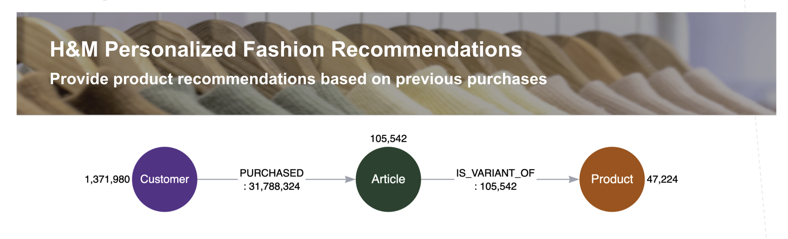

# Graph Machine Learning For Recommendations with Semantic Search & RAG

This example leverages the [H&M Personalized Fashion Recommendations Dataset](https://www.kaggle.com/competitions/h-and-m-personalized-fashion-recommendations/data) to show how to use Graph Machine Learning to power personalized recommendations in semantic search and Retrieval Augmented Generation (RAG).

## Directions

1. __Make a copy of `env.template` and name it `.env`.__
   1. Neo4j Config - Fill in as appropriate. You will need the Graph Data Science plugin installed on your Neo4j instance. [AuraDS](https://console.neo4j.io/?product=aura-ds) is recommended for using the entire dataset, but you can also use [sandbox](https://sandbox.neo4j.com/?usecase=graph-data-science2) for a free experience. 
   2. EMBEDDING_MODEL: You can choose between openai, hugging face sentence transformer, or AWS Bedrock for the text embedding model. If you don't know which to choose, start with OpenAI. Be sure to fill in credentials as appropriate in `.env`. __OpenAI Embedding were used for the current Notebooks__

2. Run through the following notebooks in order: 
   1. Load the graph with `p0-load.ipynb`: Note that there is a mechanism to sample customers down so you do not need to ingest the entire sample dataset.  This is recommended, especially when using sandbox or smaller Neo4j instances.  The text embedding can also take a while.
   2. \[Optional\]: `p1-simple-vector-search.ipynb` - Explore simple vector search. We will repeat this later with the final notebook, so this is not strictly needed. 
   3. `p2-run-knn-similarity.ipynb` - Use Graph Data Science Node Embedding and K-Nearest Neighbor (KNN) to Enrich the Graph for Recommendations
   4. `p3-semantic-search-with-recommendations.ipynb` - Demonstrate retrieval of recommendations with semantic search

